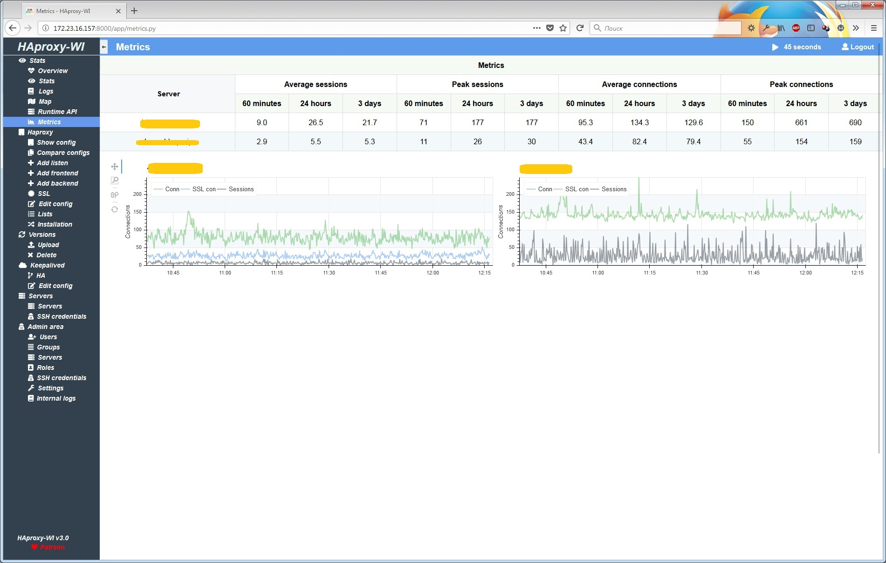

# Haproxy web interface
Web interface(user-friendly web GUI, alerting, monitoring and secure) for managing Haproxy servers. Leave your [feedback](https://github.com/Aidaho12/haproxy-wi/issues)

# Donate
Support the project
[](https://www.paypal.me/loginovpavel) or [Patreon](https://www.patreon.com/haproxy_wi/overview)

# Youtube
[Demo video](https://www.youtube.com/channel/UCo0lCg24j-H4f0S9kMjp-_w)

# Twitter
[Twitter](https://twitter.com/haproxy_wi), subscribe! I will write there about all the changes and news

# Demo site
[Demo site](https://demo.haproxy-wi.org) Login/password: admin/admin. Server resets every hour.


# Features:
1.	Configure HAproxy In a jiffy with haproxy-wi
2.	View and analyse Status of all Frontend/backend server via haproxy-wi from a single control panel.
3.	Enable/disable servers through stats page without rebooting HAProxy
4.	View/Analyse HAproxy logs straight from the haproxy-wi web interface
5.	Create and visualise the HAproxy workflow from Web Ui.
6.	Push Your changes to your HAproxy servers with a single click through web interface.
7.	Get info on past changes, Evaluate your config files and restore a previous stable config anytime with a single click straight from Web interface.
8.	Add/Edit Frontend or backend servers via web interface with a click of a button.
9.	Edit config of HAproxy and push changes to All Master/Slave server with a single click.
10.	Add Multiple server to ensure Config Sync between servers.
11.	Auto management of ports assigned to Fronted. 
12.	Evaluate the changes of recent configs pushed to HAproxy instances straight from web ui
13.	Multiple User Roles support for privileged based Viewing and editing of Config.
14.	Create Groups and add /remove servers to ensure proper identification for your HAproxy Clusters
15.	Send notifications to telegram directly from haproxy-wi.
16.	haproxy-wi supports high Availability to ensure uptime to all Master slave servers configured.
17.	SSL certificate support.
18.	SSH Key support for managing multiple HAproxy Servers straight from haproxy-wi
19. SYN flood protect
20. Alerting about changes backends state
21. Alerting about HAProxy service state
22. Metrics incoming connections
23. Web acceleration settings
24. Web application firewall
25. LDAP support
26. Keep active HAProxy service
27. Ability to hide parts of the config with tags for users with "guest" role:  "HideBlockStart" and "HideBlockEnd"



# Install

## RPM
Install repository^
```
yum install https://repo.haproxy-wi.org/el7/haproxy-wi-release-7-1-0.noarch.rpm 
```
After install HAProxy-WI:
```
yum install haproxy-wi
```
## Script
The installer will ask you a few questions
```
$ git clone https://github.com/Aidaho12/haproxy-wi.git /var/www/haproxy-wi
$ cd /var/www/haproxy-wi
$ chmod +x install.sh
$ sudo ./install.sh
```

## Manual install
For install just clone:
```
$ cd /var/www/
$ git clone https://github.com/Aidaho12/haproxy-wi.git /var/www/haproxy-wi
$ chown -R apache:apache haproxy-wi/
Or if use Debian/Ubuntu:
$ chown -R www-data:www-data haproxy-wi/
$ pip3 install -r haproxy-wi/requirements.txt 
$ chmod +x haproxy-wi/app/*.py 
$ sudo ln -s /usr/bin/python3.5 /usr/bin/python3
```

For Apache do virtualhost with cgi-bin. Like this:
```
# vi /etc/httpd/conf.d/haproxy-wi.conf 
<VirtualHost *:8080>
        SSLEngine on
        SSLCertificateFile /var/www/haproxy-wi/app/certs/haproxy-wi.crt
        SSLCertificateKeyFile /var/www/haproxy-wi/app/certs/haproxy-wi.key

        ServerName haproxy-wi
        ErrorLog /var/log/httpd/haproxy-wi.error.log
        CustomLog /var/log/httpd/haproxy-wi.access.log combined
        TimeOut 600
        LimitRequestLine 16380
		
        DocumentRoot /var/www/haproxy-wi
        ScriptAlias /cgi-bin/ "/var/www/haproxy-wi/app/"

        <Directory /var/www/haproxy-wi/app>
                Options +ExecCGI
                AddHandler cgi-script .py
                Order deny,allow
                Allow from all
        </Directory>
		
        <Directory /var/www/haproxy-wi/app/certs>
            Options +ExecCGI -Indexes +MultiViews
			Order Deny,Allow
			Deny from all
        </Directory>
	
	<Directory /var/www/haproxy-wi/keys>
		Options +ExecCGI -Indexes +MultiViews
		Order Deny,Allow
  		Deny from all
	</Directory>

	<FilesMatch "\.cfg$">
  		Order Deny,Allow
  		Deny from all
	</FilesMatch>
	
	<FilesMatch "\.db$">
  		Order Deny,Allow
  		Deny from all
	</FilesMatch>
</VirtualHost>
```
# Docker
```
docker service create --detach=false --name haproxy-wi --mount type=volume,src=haproxy-wi,dst=/var/www/haproxy-wi/app -p 8080:443 aidaho/haproxy-wi
```
or
```
docker run -d --name haproxy-wi -v haproxy-wi:/var/www/haproxy-wi/app -p 8080:443 aidaho/haproxy-wi 
```
# OS support
HAProxy-WI was tested on EL 7, and all scripts too. Debian/Ubuntu OS support at 'beta' stage, may work not correct

# Database support

Default Haproxy-WI use Sqlite, if you want use MySQL enable in config, and create database:

### For MySQL support:
```
MariaDB [(none)]> create user 'haproxy-wi'@'%';
MariaDB [(none)]> create database haproxywi;
MariaDB [(none)]> grant all on haproxywi.* to 'haproxy-wi'@'%' IDENTIFIED BY 'haproxy-wi';
MariaDB [(none)]> grant all on haproxywi.* to 'haproxy-wi'@'localhost' IDENTIFIED BY 'haproxy-wi';
```


# Settings
```
Edit $HOME_HAPROXY-WI/app/haproxy-wi.cfg with your env
```

Login https://haproxy-wi-server/users.py, and add: users, groups and servers. Default: admin/admin


For Runtime API, Metrics and Alerting enable state file and stat socket on HAproxt servers and need install socat on all haproxy servers, and configre HAProxy:
```
    global
        stats socket *:1999 level admin 
        stats socket /var/run/haproxy.sock mode 600 level admin
        server-state-file /etc/haproxy/haproxy/haproxy.state
		
    defaults
        load-server-state-from-file global
		
    listen stats 
        stats admin if TRUE 
   ```


# Update
```
# cd /var/www/haproxy-wi
# ./update.sh
```

After update old config saved at /tmp/ folder. Compare new and old config, if in new no changes overwrite the new configuration with the old one, or edit new with your ENV.

# Update DB
```
$ cd /var/www/haproxy-wi/app
$ ./create_db.py
```
# Troubleshooting
If you have error:
```
Forbidden
You don't have permission to access /app/overview.py on this server. 
```

Check owner(must be apache, or another user for apache)

If at first login you have:
```
Internal Server Error
```

Do this:
```
$ cd /var/www/haproxy-wi/app
$ ./create_db.py
```
and check executeble py files

If you see plain text, check section "Directory" in httpd conf
