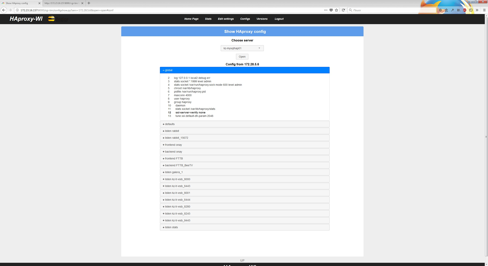
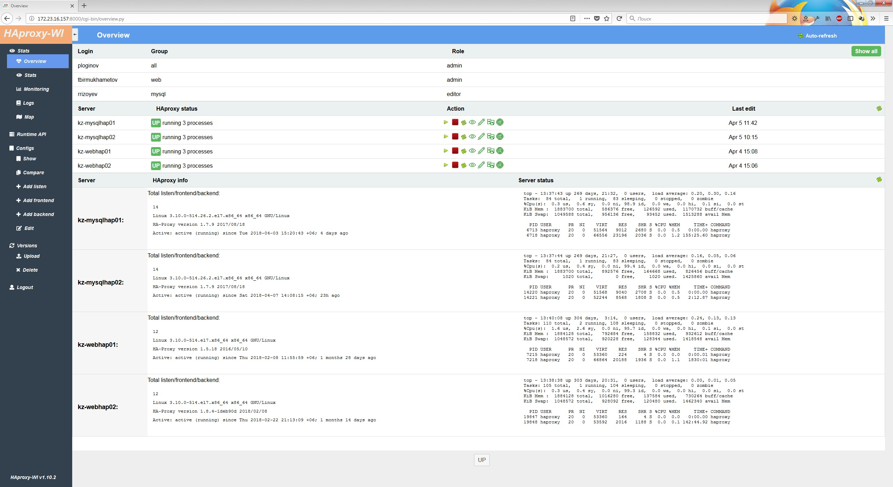
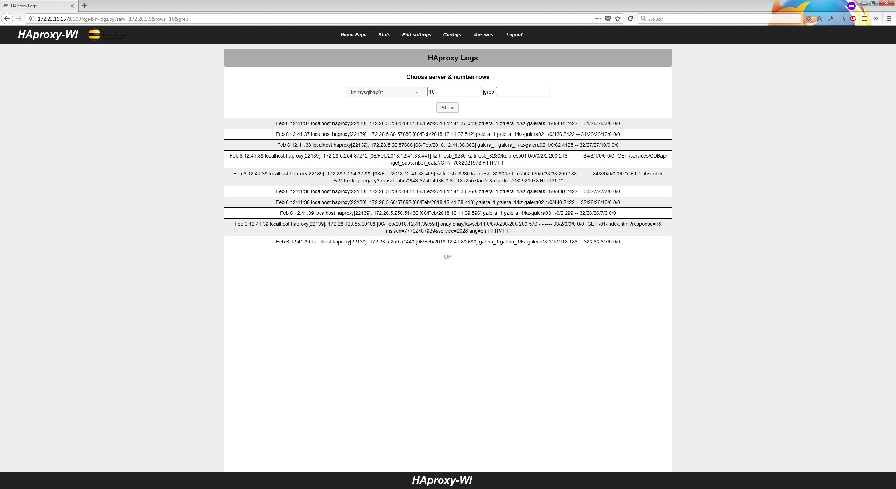

# Haproxy web interface
A simple web interface(user-frendly web GUI) for managing Haproxy servers



# Capabilities:
1. View statistics of all servers in one place
2. Server and service statsus in one place
3. View logs of all servers in one place
4. Map frontend, backends and servers
5. Disabling / enabling the backend servers without reboot (after reboot, will work as specified in the config), viewing server state data
6. Browsing Configs
7. Add sections: listen, frontend, backend from web interface
8. Editing configs
9. Rollback to previous versions of the config
10. Comparing versions of configs
11. Users roles: admin, editor, viewer
12. Telegram notification

# Install
Can be used as a service, or via fastaci apache + fastCGI(recommend, because it works faster), how to use the service:

For install just dowload archive and untar somewhere:
```
$ cd /opt
$ unzip master.zip
$ mv haproxy-wi-master/ haproxy-wi
$ cd /opt/haproxy-wi
$ chmod +x install.sh
$ sudo ./install.sh
```
Edit listserv.py, add your HAproxy servers. 



# Settings
edit haproxy-webintarface.config with your env

copy ssh key on all HAproxy servers

For online edit HAproxy settings enable socket on HAproxt servers:
```
global
    log         172.28.0.5 local2 debug err
    stats socket *:1999 level admin
   ```


# Start and auto start
```
systemctl enable haproxy-wi.service
systemctl start haproxy-wi.service
```

# Deb support

Sorry, but not use, because  adapt yourself

# Further development

Offer your ideas and wishes, ask questions. All this is [welcomed](https://github.com/Aidaho12/haproxy-wi/issues)


