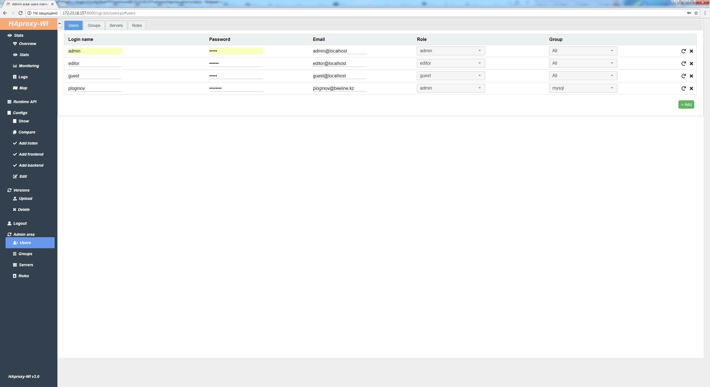

#Meet Haproxy-wi 2.0! Now with DB and Admin web interface! Life has become easier, life has become more cheerful!

# Haproxy web interface
A simple web interface(user-frendly web GUI) for managing Haproxy servers. Leave your [feedback](https://github.com/Aidaho12/haproxy-wi/issues)


# Capabilities:
1. View statistics of all servers in one place
2. Server and service statsus in one place
3. View logs of all servers in one place
4. Map frontend, backends and servers
5. Runtime API with the ability to save changes (need install socat on all haproxy servers)
6. Browsing Configs
7. Add sections: listen, frontend, backend from web interface
8. Editing configs
9. Rollback to previous versions of the config
10. Comparing versions of configs
11. Users roles: admin, editor, viewer
12. Telegram notification

# Install
Can be used as a service, or via fastaci apache + fastCGI(recommend, because it works faster).

How to use the service:

For install just dowload archive and untar somewhere:
```
$ cd /opt
$ unzip master.zip
$ mv haproxy-wi-master/ haproxy-wi
$ cd /opt/haproxy-wi
$ chmod +x install.sh
$ sudo ./install.sh
```

For Apache just do virtualhost with cgi-bin.


# Settings
```
cd $HOME_HAPROXY-WI/cgi-bin/
chmod +x *.py
```

Run create_db.py for DB createing

Edit $HOME_HAPROXY-WI/cgi-bin/haproxy-webintarface.config with your env

Login http://haproxy-wi-server/users.py, and add: users, groups and servers. Default: admin/admin



Copy ssh key on all HAproxy servers

For Runtime API enable state file on HAproxt servers and need install socat on all haproxy servers:
```
    global
       server-state-file /etc/haproxy/haproxy/haproxy.state
    defaults
       load-server-state-from-file global
   ```


# Start and autostart if service
```
systemctl enable haproxy-wi.service
systemctl start haproxy-wi.service
```

# Deb support

Sorry, but not use, because  adapt yourself

# Further development and support

Offer your ideas and wishes, ask questions. All this is [welcomed](https://github.com/Aidaho12/haproxy-wi/issues)


