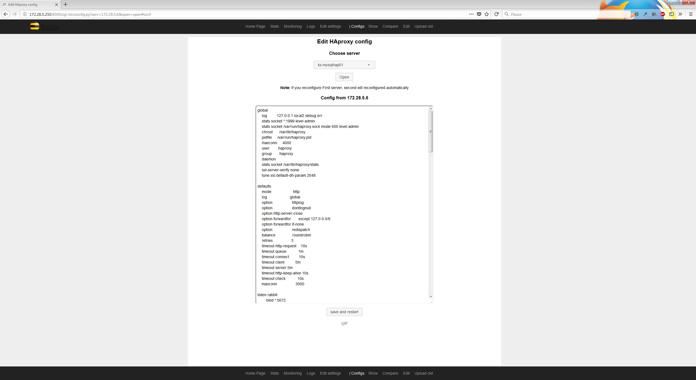

# haproxy web intarface
A simple web interface for managing Haproxy servers



# Capabilities:
1. View statistics of all servers in one place
2. View logs of all servers in one place
3. Disabling / enabling the backend servers without reboot (after reboot, will work as specified in the config), viewing server state data
4. Browsing Configs
5. Editing configs
6. Rollback to previous versions of the config
7. Comparing versions of configs

# Install
For install just dowload archive and untar somewhere:
```
$ cd /opt/haproxy-webintarface
$ tar xf haproxy-webintarface-master.zip
$ pip3 -r requirements.txt
```
If foler not /opt/haproxy/, edit server.py:
```
path_config = "/opt/haproxy/haproxy-webintarface.config"
```

# Settings
edit haproxy-webintarface.config with your env

copy ssh key on all HAproxy servers

For online edit HAproxy settings enable socket on HAproxt servers:
```
global
    log         172.28.0.5 local2 debug err
    stats socket *:1999 level admin
   ```


# Start
Create systemd service to auto start:
```
[Unit]
Description=Haproxy web interface
After=syslog.target network.target 

[Service]
Type=simple
User=user

ExecStart=/opt/haproxy/server.py >> /opt/haproxy/log/haproxy-webface.log 

RestartSec=2s
Restart=on-failure
TimeoutStopSec=1s

[Install]
WantedBy=multi-user.target
```

