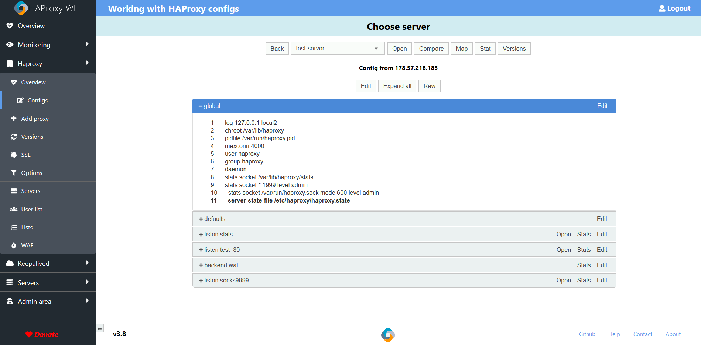
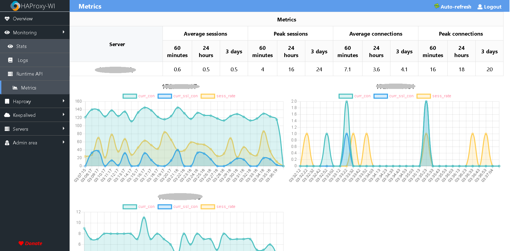
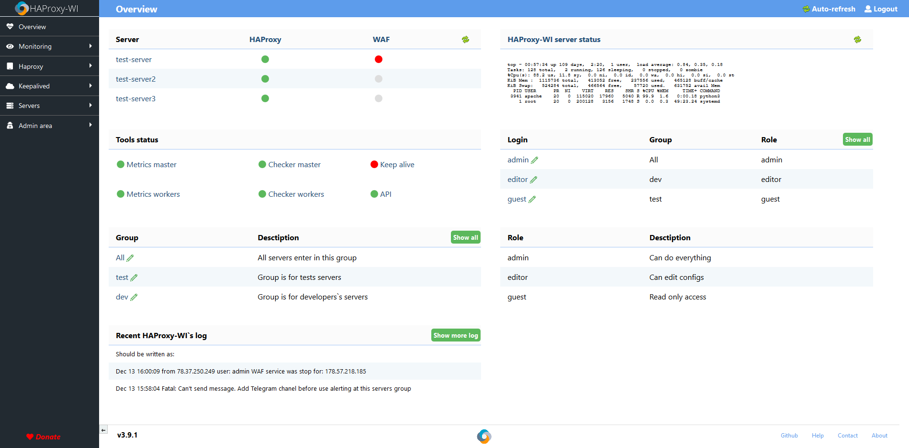
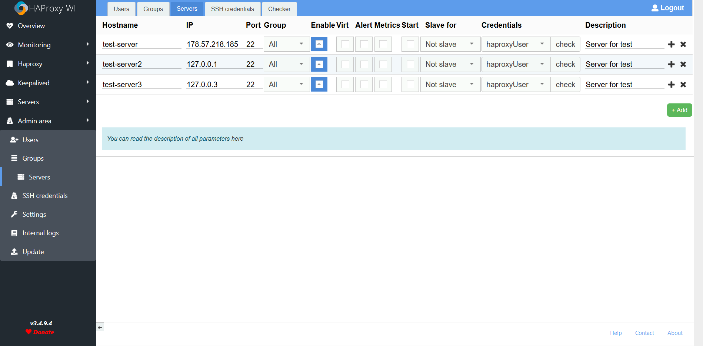
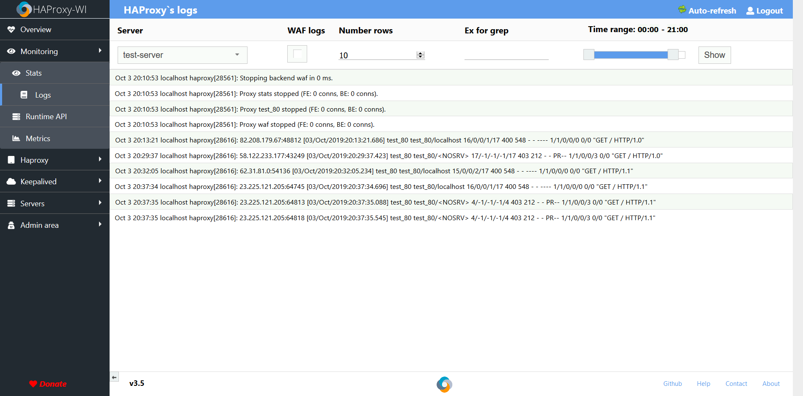

# Haproxy web interface
Web interface(user-friendly web GUI, alerting, monitoring and secure) for managing Haproxy servers. Leave your [feedback](https://github.com/Aidaho12/haproxy-wi/issues)

# Youtube
[Demo video](https://www.youtube.com/channel/UCo0lCg24j-H4f0S9kMjp-_w)

# Twitter
[Twitter](https://twitter.com/haproxy_wi), subscribe! I will write there about all the changes and news

# Telegram
[Channel](https://t.me/haproxy_wi) about Haproxy-wi, talks and questions are welcome
# Demo site
[Demo site](https://demo.haproxy-wi.org) Login/password: admin/admin. Server resets every hour.



# Features:
1.	Configure HAProxy In a jiffy with haproxy-wi
2.	View and analyse Status of all Frontend/backend server via haproxy-wi from a single control panel.
3.	Enable/disable servers through stats page without rebooting HAProxy
4.	View/Analyse HAproxy logs straight from the haproxy-wi web interface
5.	Create and visualise the HAproxy workflow from Web Ui.
6.	Push Your changes to your HAproxy servers with a single click through web interface
7.	Get info on past changes, Evaluate your config files and restore a previous stable config anytime with a single click straight from Web interface
8.	Add/Edit Frontend or backend servers via web interface with a click of a button.
9.	Edit config of HAProxy and push changes to All Master/Slave server with a single click
10.	Add Multiple server to ensure Config Sync between servers.
11.	Auto management of ports assigned to Fronted. 
12.	Evaluate the changes of recent configs pushed to HAproxy instances straight from web ui
13.	Multiple User Roles support for privileged based Viewing and editing of Config
14.	Create Groups and add /remove servers to ensure proper identification for your HAproxy Clusters
15.	Send notifications to telegram directly from HAProxy-WI
16.	HAProxy-WI supports high Availability to ensure uptime to all Master slave servers configured
17.	SSL certificate support.
18.	SSH Key support for managing multiple HAproxy Servers straight from haproxy-wi
19. SYN flood protect
20. Alerting about changes backends state
21. Alerting about HAProxy service state
22. Metrics incoming connections
23. Web acceleration settings
24. Web application firewall
25. LDAP support
26. Keep active HAProxy service
27. Ability to hide parts of the config with tags for users with "guest" role:  "HideBlockStart" and "HideBlockEnd"
28. Mobile-ready desing
29. REST API
30. Installation and Upgrading HAProxy service via HAProxy-WI



# Install

## RPM
Install repository:
```
yum install https://repo.haproxy-wi.org/haproxy-wi-release-7-1-0.noarch.rpm 
```
After install HAProxy-WI:
```
yum install haproxy-wi
```

Supports EL7 and EL8

#### Before uses RPM repository you should donate to support project on [Patreon](https://www.patreon.com/haproxy_wi/overview) or on [PayPal](https://www.paypal.me/loginovpavel) and I will send you credentials for access. Actual prices you can see on [Patreon](https://www.patreon.com/haproxy_wi/overview)

### More information on the official [site](https://haproxy-wi.org/installation.py#rpm)

## Manual install
For install just clone:
```
CentOS:
$ sudo 	yum -y install git nmap-ncat net-tools python35u dos2unix python35u-pip mod_ssl httpd python35u-devel gcc-c++ openldap-devel python-devel python-jinja2 python35u-mod_wsgi ansible
$ cd /var/www/
$ git clone https://github.com/Aidaho12/haproxy-wi.git /var/www/haproxy-wi
$ chown -R apache:apache haproxy-wi/

Or if use Debian/Ubuntu:

$ sudo 	apt-get install git  net-tools lshw dos2unix apache2 gcc netcat python3.5 python3.5-mod_wsgi mod_ssl python3-pip g++ freetype2-demos libatlas-base-dev openldap-dev libpq-dev python-dev libxml2-dev libxslt1-dev libldap2-dev libsasl2-dev libffi-dev python3-dev libssl-dev ansible -y
$ git clone https://github.com/Aidaho12/haproxy-wi.git /var/www/haproxy-wi
$ chown -R www-data:www-data haproxy-wi/

Both

$ pip3 install -r haproxy-wi/requirements.txt 
$ chmod +x haproxy-wi/app/*.py 
$ sudo ln -s /usr/bin/python3.5 /usr/bin/python3
$ sudo cp config_other/logrotate/* /etc/logrotate.d/
$ sudo cp config_other/syslog/* /etc/rsyslog.d/
$ sudo cp config_other/systemd/* /etc/systemd/system/
$ sudo systemctl daemon-reload      
$ sudo systemctl restart httpd
$ sudo systemctl restart rsyslog
$ sudo systemctl restart metrics_haproxy.service
$ sudo systemctl restart checker_haproxy.service
$ sudo systemctl restart keep_alive.service
$ sudo systemctl enable metrics_haproxy.service
$ sudo systemctl enable checker_haproxy.service
$ sudo systemctl enable keep_alive.service
$ sudo mkdir /var/www/haproxy-wi/app/certs
$ sudo mkdir /var/www/haproxy-wi/keys
$ sudo mkdir /var/www/haproxy-wi/configs/
$ sudo mkdir /var/www/haproxy-wi/configs/hap_config/
$ sudo mkdir /var/www/haproxy-wi/configs/kp_config/
$ sudo mkdir /var/www/haproxy-wi/log/


```

For Apache do virtualhost with cgi-bin. Like this:
```
# vi /etc/httpd/conf.d/haproxy-wi.conf 
<VirtualHost *:8080>
		WSGIDaemonProcess api display-name=%{GROUP} user=apache group=apache processes=1 threads=5
        WSGIScriptAlias /api /var/www/haproxy-wi/api/app.wsgi

        <Directory /var/www/haproxy-wi/api>
            WSGIProcessGroup api
            WSGIApplicationGroup %{GLOBAL}
            Order deny,allow
            Allow from all
        </Directory>

        SSLEngine on
        SSLCertificateFile /var/www/haproxy-wi/app/certs/haproxy-wi.crt
        SSLCertificateKeyFile /var/www/haproxy-wi/app/certs/haproxy-wi.key

        ServerName haproxy-wi
        ErrorLog /var/log/httpd/haproxy-wi.error.log
        CustomLog /var/log/httpd/haproxy-wi.access.log combined
        TimeOut 600
        LimitRequestLine 16380
		
        DocumentRoot /var/www/haproxy-wi
        ScriptAlias /cgi-bin/ "/var/www/haproxy-wi/app/"

        <Directory /var/www/haproxy-wi/app>
		    DirectoryIndex overview.py
            Options +ExecCGI
            AddHandler cgi-script .py
            Order deny,allow
            Allow from all
        </Directory>
		
        <Directory /var/www/haproxy-wi/app/certs>
            Options +ExecCGI -Indexes +MultiViews
			Order Deny,Allow
			Deny from all
        </Directory>
	
        <Directory /var/www/haproxy-wi/keys>
		    Options +ExecCGI -Indexes +MultiViews
		    Order Deny,Allow
		    Deny from all
        </Directory>

        <FilesMatch "\.cfg$">
			Order Deny,Allow
			Deny from all
        </FilesMatch>
		
        <FilesMatch "\.db$">
		    Order Deny,Allow
		    Deny from all
        </FilesMatch>
		
        <IfModule mod_headers.c>
		    Header set X-XSS-Protection: 1;
		    Header set X-Frame-Options: deny
		    Header set X-Content-Type-Options: nosniff
		    Header set Strict-Transport-Security: max-age=3600;
		    Header set Cache-Control no-cache
		    Header set Expires: 0

		    <filesMatch ".(ico|css|js|gif|jpeg|jpg|png|svg|woff|ttf|eot)$">
				Header set Cache-Control "max-age=86400, public"
		    </filesMatch>
		</IfModule>
</VirtualHost>
```

### More information on the official [site](https://haproxy-wi.org/installation.py#manual)

# OS support
HAProxy-WI was tested on EL7, EL8 and all scripts too. Debian/Ubuntu OS support at 'beta' stage, may work not correct

# Database support

Default Haproxy-WI use Sqlite, if you want use MySQL enable in config, and create database:

### For MySQL support:
```
MariaDB [(none)]> create user 'haproxy-wi'@'%';
MariaDB [(none)]> create database haproxywi;
MariaDB [(none)]> grant all on haproxywi.* to 'haproxy-wi'@'%' IDENTIFIED BY 'haproxy-wi';
MariaDB [(none)]> grant all on haproxywi.* to 'haproxy-wi'@'localhost' IDENTIFIED BY 'haproxy-wi';
```

### More information on the official [site](https://haproxy-wi.org/settings.py#db_settings)



# Settings
```
Edit $HOME_HAPROXY-WI/app/haproxy-wi.cfg with your env
```

Login https://haproxy-wi-server/users.py, and add: users, groups and servers. Default: admin/admin



For Runtime API, Metrics and Alerting enable state file and stat socket on HAproxt servers and need install socat on all haproxy servers, and configre HAProxy:
```
    global
        stats socket *:1999 level admin 
        stats socket /var/run/haproxy.sock mode 600 level admin
        server-state-file /etc/haproxy/haproxy.state
		
    defaults
        load-server-state-from-file global
		
    listen stats 
        bind *:8085
        stats enable
        stats uri /stats
        stats realm HAProxy-04\ Statistics
        stats auth admin:password
        stats admin if TRUE 
   ```



# Create and update DB
```
$ cd /var/www/haproxy-wi/app
$ ./create_db.py
```
# Troubleshooting
If you have error:
```
Forbidden
You don't have permission to access /app/overview.py on this server. 
```

Check owner(must be apache, or another user for apache)

If at first login you have:
```
Internal Server Error
```

Do this:
```
$ cd /var/www/haproxy-wi/app
$ ./create_db.py
```
and check executeble py files

If you see plain text, check section "Directory" in httpd conf
