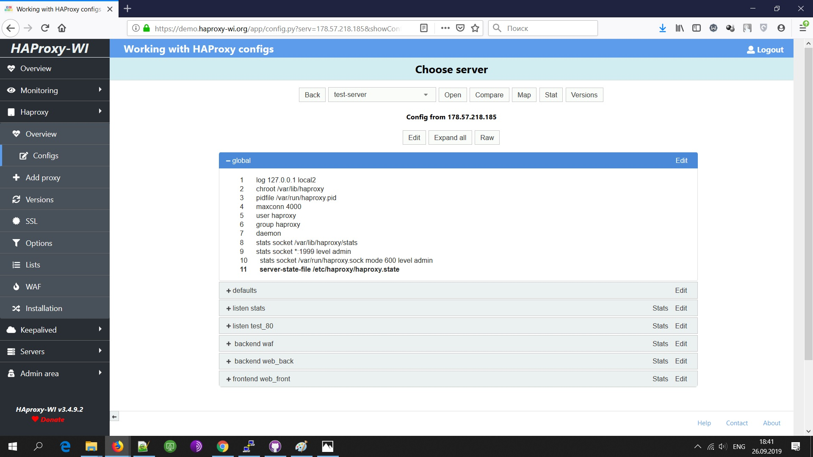
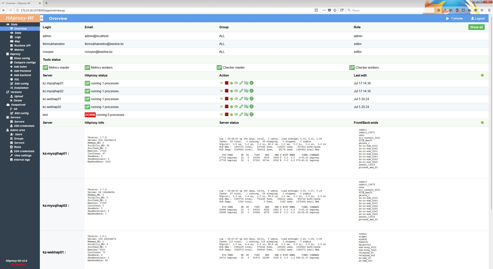
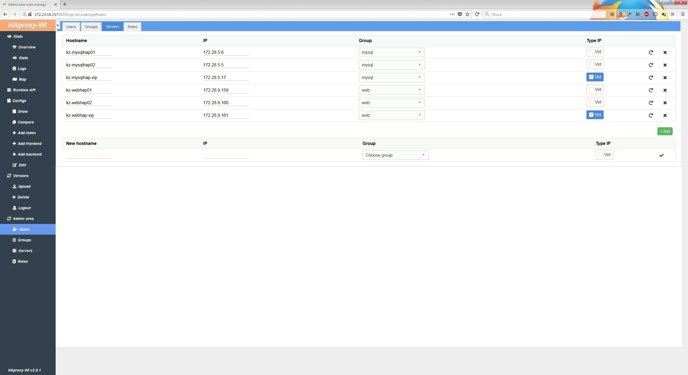
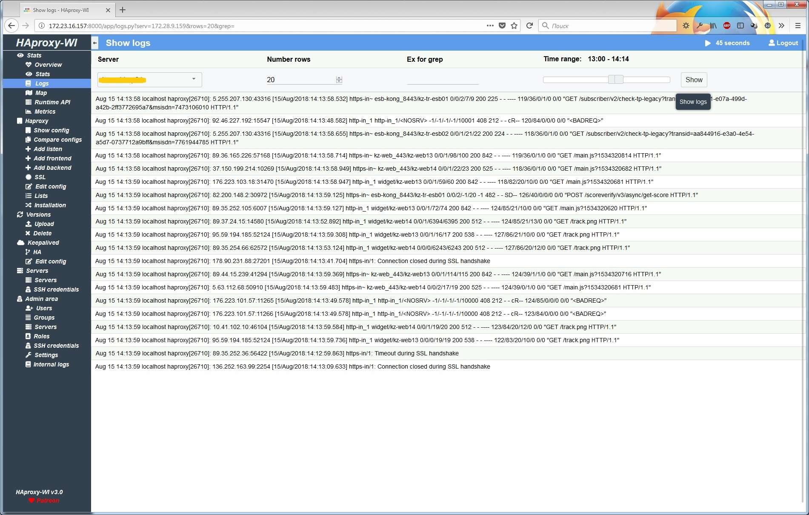

# Haproxy web interface
Web interface(user-frendly web GUI) for managing Haproxy servers. Leave your [feedback](https://github.com/Aidaho12/haproxy-wi/issues)

# Donate
Support the project
[](https://www.paypal.com/cgi-bin/webscr?cmd=_donations&business=5XVQTMKQS57NE&lc=US&Z3JncnB0=) or [Patreon](https://www.patreon.com/haproxy_wi/overview)



# Features:
1.	Configure HAproxy In a jiffy with haproxy-wi
2.	View and analyse Status of all Frontend/backend server via haproxy-wi from a single control panel.
3.	Enable/disable servers through stats page without rebooting HAProxy
4.	View/Analyse HAproxy logs straight from the haproxy-wi web interface
5.	Create and visualise the HAproxy workflow from Web Ui.
6.	Push Your changes to your HAproxy servers with a single click through web interface.
7.	Get info on past changes, Evaluate your config files and restore a previous stable config anytime with a single click straight from Web interface.
8.	Add/Edit Frontend or backend servers via web interface with a click of a button.
9.	Edit config of HAproxy and push changes to All Master/Slave server with a single click.
10.	Add Multiple server to ensure Config Sync between servers.
11.	Auto management of ports assigned to Fronted. 
12.	Evaluate the changes of recent configs pushed to HAproxy instances straight from web ui
13.	Multiple User Roles support for privileged based Viewing and editing of Config.
14.	Create Groups and add /remove servers to ensure proper identification for your HAproxy Clusters
15.	Send notifications to telegram directly from haproxy-wi.
16.	haproxy-wi supports high Availability to ensure uptime to all Master slave servers configured.
17.	SSL certificate support.
18.	SSH Key support for managing multiple HAproxy Servers straight from haproxy-wi


# Install
The installer will ask you a few questions
```
$ git clone https://github.com/Aidaho12/haproxy-wi.git /var/www/haproxy-wi
$ cd /var/www/haproxy-wi
$ chmod +x install.sh
$ sudo ./install
```
## Manual install
For install just clone:
```
$ cd /var/www/
$ git clone https://github.com/Aidaho12/haproxy-wi.git /var/www/haproxy-wi
$ chown -R apache:apache haproxy-wi/
$ pip3 install -r haproxy-wi/requirements.txt 
$ chmod +x haproxy-wi/app/*.py 
```

For Apache do virtualhost with cgi-bin. Like this:
```
# vi /etc/httpd/conf.d/haproxy-wi.conf 
<VirtualHost *:8080>
        ServerName haproxy-wi
        ErrorLog /var/log/httpd/haproxy-wi.error.log
        CustomLog /var/log/httpd/haproxy-wi.access.log combined

        DocumentRoot /var/www/haproxy-wi
        ScriptAlias /cgi-bin/ "/var/www/haproxy-wi/app/"

        <Directory /var/www/haproxy-wi/app>
                Options +ExecCGI
                AddHandler cgi-script .py
                Order deny,allow
                Allow from all
        </Directory>
		
		<FilesMatch "\.config$">
                Order Deny,Allow
                Deny from all
        </FilesMatch>
</VirtualHost>
```
# Docker
```
docker service create --detach=false --name haproxy-wi --mount type=volume,src=haproxy-wi,dst=/var/www/haproxy-wi/app -p 8080:80 aidaho/haproxy-wi
```

# Database support

Default Haproxy-WI use Sqlite, if you want use MySQL enable in config, and create database:

### For MySQL support:
```
MariaDB [(none)]> create user 'haproxy-wi'@'%';
MariaDB [(none)]> create database haproxywi;
MariaDB [(none)]> grant all on haproxywi.* to 'haproxy-wi'@'%' IDENTIFIED BY 'haproxy-wi';
MariaDB [(none)]> grant all on haproxywi.* to 'haproxy-wi'@'localhost' IDENTIFIED BY 'haproxy-wi';
```


# Settings
```
Edit $HOME_HAPROXY-WI/app/haproxy-webintarface.config with your env
```
Copy ssh key on all HAproxy servers

Login http://haproxy-wi-server/users.py, and add: users, groups and servers. Default: admin/admin



For Runtime API enable state file on HAproxt servers and need install socat on all haproxy servers, and configre HAProxy:
```
    global
		stats socket *:1999 level admin 
		stats socket /var/run/haproxy.sock mode 600 level admin
		server-state-file /etc/haproxy/haproxy/haproxy.state
		
    defaults
		load-server-state-from-file global
		
	listen stats 
		stats admin if TRUE 
   ```


# Update
```
# cd /var/www/haproxy-wi
# chmod +x update.sh
# ./update.sh
```

After update old config saved at /tmp/ folder. Compare new and old config, if in new no changes overwrite the new configuration with the old one, or edit new with your ENV.

# Update DB
```
$ cd /var/www/haproxy-wi/app
$ ./update_db.py
```
# Troubleshooting
If you have error:
```
Forbidden
You don't have permission to access /app/overview.py on this server. 
```

Check owner(must be apache, or another user for apache)

If at first login you have:
```
Internal Server Error
```

Do this:
```
$ cd /var/www/haproxy-wi/app
$ ./update_db.py
```
and check executeble py files

If you see plain text, check section "Directory" in httpd conf

# Further development and support

Offer your ideas and wishes, ask questions. All this is [welcomed](https://github.com/Aidaho12/haproxy-wi/issues)


