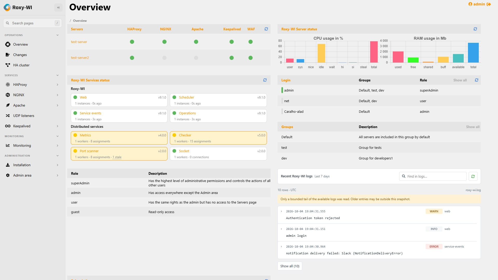
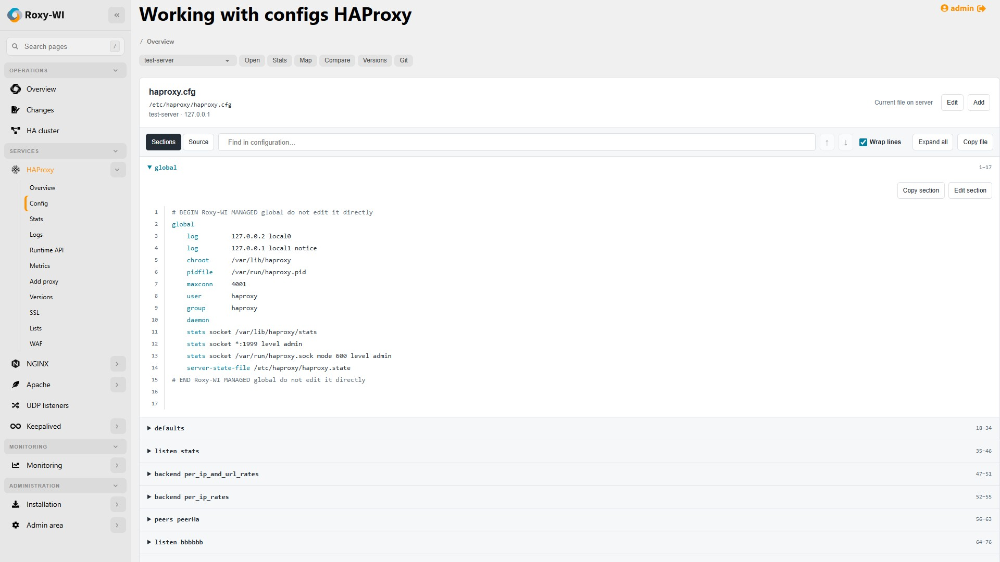
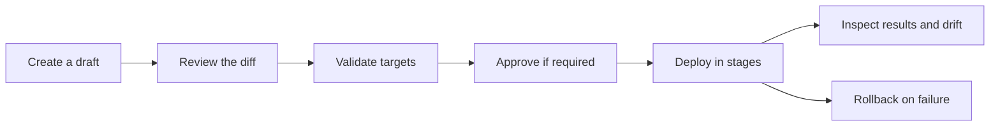

<p align="center">
  
</p>

# Manage your proxies. Control every change.

> This documentation applies to **Roxy-WI 9.1 and later**.

**Roxy-WI is a self-hosted web interface for HAProxy, NGINX, Apache and Keepalived.**
Connect existing servers, review configuration changes, coordinate deployments
and follow service health from one place. Built for operators and teams managing
proxies across multiple servers and environments.

**[Try the live demo](https://demo.roxy-wi.org) · [Get started](#get-started) · [Documentation](https://roxy-wi.org/description) · [Plans & support](https://roxy-wi.org/pricing)**

[](https://github.com/roxy-wi/roxy-wi/actions/workflows/tests.yml)
[](https://github.com/roxy-wi/roxy-wi/actions/workflows/container.yml)
[](https://github.com/roxy-wi/roxy-wi/actions/workflows/codeql-analysis.yml)
[](LICENSE)

[](.github/images/overview.jpg)

*Current demo interface with worker health and recent logs. Click a service status to inspect its diagnostics.*

## What you can do

| Your task | How Roxy-WI helps |
| --- | --- |
| Review changes before touching production | Compare configuration differences, validate candidates, require approval and keep an audit trail with **Change Center**. |
| Coordinate a deployment across HA nodes | Choose canaries and batches, check each target, pause between stages and recover or roll back failed changes. |
| Bring existing infrastructure into one interface | Connect servers over SSH; manage HAProxy, NGINX, Apache and Keepalived configurations and service actions. |
| Give the right people access | Organize servers into groups, assign roles and service permissions, and integrate OIDC or LDAP authentication. |
| Keep service health visible | Inspect backends and logs; add monitoring, traffic metrics and notifications as your needs grow. |
| Manage certificates and configuration history | Issue Let's Encrypt certificates, retain configuration versions and configure backup destinations. |

Some capabilities require a subscription. Change Center requires **Premium**;
see [feature availability](https://roxy-wi.org/pricing) before planning an evaluation.

<details>
<summary>See the HAProxy configuration workspace</summary>

[](.github/images/haproxy-config.jpg)

*Search configuration sections, switch to source view and edit through a form or text editor, depending on how the section was created.*

</details>

## See a change through to deployment

Change Center keeps the candidate, review decision and target results together.
Creating a draft does not replace the running configuration.


```mermaid
flowchart LR
    A[Create a draft] --> B[Review the diff]
    B --> C[Validate targets]
    C --> D[Approve if required]
    D --> E[Deploy in stages]
    E --> F[Inspect results and drift]
    E --> G[Rollback on failure]
```

Read the [Change Center guide](https://roxy-wi.org/description/change-center) for
canary rollouts, manual promotion, per-node results and recovery.

For a browser-only look, open the [live demo](https://demo.roxy-wi.org) with
`admin` / `admin`. It is a shared demonstration environment that resets hourly.
Use demonstration data only.

## Get started

**Install Linux packages:** see [deployment platforms and installation](https://roxy-wi.org/installation).

**Try Roxy-WI locally:** use the Compose quick start below.
It builds this checkout, starts the application and background workers, and exposes
the interface only at `https://localhost:8443`.

Requirements: Git, Python 3.10+, Docker with Linux containers, and Docker Compose 2.24.4+.

```sh
git clone https://github.com/roxy-wi/roxy-wi.git
cd roxy-wi
python3 docker/quickstart.py start
python3 docker/quickstart.py password
```

Open **https://localhost:8443**, accept the local evaluation certificate, and sign
in as `admin` with the generated password. Secrets and application data persist
between starts. The first build downloads application dependencies.

Continue with [your first server](https://roxy-wi.org/howto/setup#server),
or read the full [quick-start guide](https://roxy-wi.org/description/operations#quickstart) for status, logs and stopping.

## Deployment choices

| Environment | Entry point |
| --- | --- |
| Linux packages | [Installation](https://roxy-wi.org/installation) and [update guide](https://roxy-wi.org/update-guide) |
| Local evaluation | [Compose quick start](https://roxy-wi.org/description/operations#quickstart) with SQLite and local HTTPS |
| Compose for your infrastructure | [Deployment guide](https://roxy-wi.org/description/operations#compose), including MariaDB, HTTPS and persistent storage |
| Kubernetes | [Published Helm chart](https://github.com/roxy-wi/roxy-wi/pkgs/container/roxy-wi-charts), [deployment guide](https://roxy-wi.org/description/operations#kubernetes) and [chart source](helm/roxy-wi) |

### Install the Helm chart

The chart is published at `oci://ghcr.io/roxy-wi/roxy-wi-charts`.
Version `9.1.0` uses the published `ghcr.io/roxy-wi/roxy-wi:9.1.0` application image
by default. Prepare `roxy-wi-values.yaml` using the
[Helm deployment guide](https://roxy-wi.org/description/operations#kubernetes),
including application secrets, RabbitMQ, persistent storage, database settings
and HTTPS ingress, then install:

```sh
helm upgrade --install roxy-wi oci://ghcr.io/roxy-wi/roxy-wi-charts \
  --version 9.1.0 --namespace roxy-wi --create-namespace \
  --values roxy-wi-values.yaml --wait --wait-for-jobs --timeout 10m
```

RabbitMQ and an optional external MariaDB/MySQL database are provisioned separately.
SQLite is the chart default for one Web replica. For an existing installation,
follow the [Helm update procedure](https://roxy-wi.org/description/operations#helm-updates)
before running an upgrade.

## Documentation

| Start here | Operate and integrate |
| --- | --- |
| [Documentation index](https://roxy-wi.org/description) | [Operations](https://roxy-wi.org/description/operations#runtime) and [troubleshooting](https://roxy-wi.org/troubleshooting) |
| [Change Center guide](https://roxy-wi.org/description/change-center) | [Configuration and settings](https://roxy-wi.org/settings) |
| [Plans and feature availability](https://roxy-wi.org/pricing) | [Configuration backups](https://roxy-wi.org/description/backup) |
| [Deployment guide](https://roxy-wi.org/description/operations) | [Let's Encrypt](https://roxy-wi.org/description/letsencrypt) |

## Community and support

- [Report a bug](https://github.com/roxy-wi/roxy-wi/issues/new/choose) or [discuss an idea](https://github.com/orgs/roxy-wi/discussions).
- [Contribute](CONTRIBUTING.md) code, documentation or a reproducible example.
- [Find support](SUPPORT.md), [compare plans](https://roxy-wi.org/pricing), or follow the [Telegram channel](https://t.me/roxy_wi_channel).
- Report vulnerabilities through the [private reporting instructions](SECURITY.md).

Roxy-WI is licensed under [Apache 2.0](LICENSE). Paid subscriptions provide the
features and support described on the [plans page](https://roxy-wi.org/pricing).
